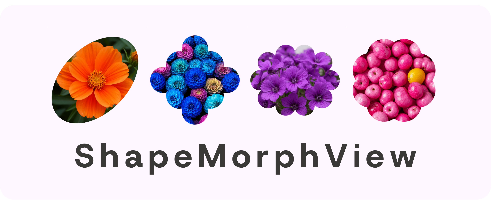
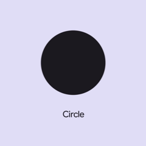
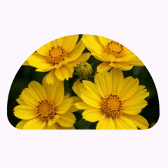

# ShapeMorphView



**ShapeMorphView** — это простая библиотека для плавного морфинга между разными формами (Shape) из Material 3 Expressive.

---

## Возможности

- Плавный морфинг между разными формами
- Изменение изображения с анимацией
- Настраиваемая длительность анимации

---

## Sample App

В проекте есть [простой пример](app/src/main/java/com/dertefter/shapemorphviewsample) использования библиотеки. Возможно он будет вам полезен.

## Подключение

Добавьте зависимость в `build.gradle.kts`:

```kotlin
dependencies {
    implementation("io.github.dertefter:shapemorphview:0.0.2")
}
```

## Использовние

Добавье ShapeMorphView в лайаут:

```xml
<com.dertefter.shapemorphview.ShapeMorphView
    android:id="@+id/smv"
    app:animationDuration="500"
    app:bgColor="?attr/colorPrimaryContainer"
    app:imageResource="@drawable/your_drawable"
    app:shape="SLANTED_SQUARE" />
```
- `animationDuration` - длительность анимации морфинга между формами в миллисекундах
- `bgColor` - цвет заливки фона фигуры
- `imageResource` - позволяет установить изображение
- `shape` - позволяет установить форму

## Формы



Библиотка поддерживает 35 форм из Material 3 Expressive:

`CIRCLE`, `SQUARE`, `SLANTED_SQUARE`, `ARCH`, `FAN`, `ARROW`, `SEMI_CIRCLE`, `OVAL`, `PILL`, `TRIANGLE`, `DIAMOND`, `CLAM_SHELL`, `PENTAGON`, `GEM`, `SUNNY`, `VERY_SUNNY`, `COOKIE_4`, `COOKIE_6`, `COOKIE_7`, `COOKIE_9`, `COOKIE_12`, `GHOSTISH`, `CLOVER_4`, `CLOVER_8`, `BURST`, `SOFT_BURST`, `BOOM`, `SOFT_BOOM`, `FLOWER`, `PUFFY`, `PUFFY_DIAMOND`, `PIXEL_CIRCLE`, `PIXEL_TRIANGLE`, `BUN`, `HEART`

## Морфинг форм

Сменить форму можно с помощью `morphToShape`. 

Установить конкретную форму можно следующим образом:
```kotlin
shapeMorphView.morphToShape(
    newShape = Shape.ARCH,
    animate = true // c анимацией или без, по умолчанию true
)
```

Форму можно выбрать из `com.dertefter.shapemorphview.Shape`

Установить случайную форму можно следующим образом:
```kotlin
shapeMorphView.morphToShape(
    newShape = shapeMorphView.getRandomShape(), 
    animate = true
)
```
Вы также можете просто не передавать форму если хотите получить морфинг до случайной формы:
```kotlin
shapeMorphView.morphToShape()
```

## Скорость анимации морфинга

Вы можете задавать скорость анимации программно:
```kotlin
shapeMorphView.animationDuration = 500
```

## Изображения



Вы можете выполнить смену изображения с морфингом до фигуры таким образом:
```kotlin
 binding.smv.setDrawableResId(
    resId = R.drawable.your_drawable,
    newShape = null, // случайная форма
    animate = true
)
```

## Лицензия

Эта библиотека распространяется под лицензией **MIT**.  
Подробнее см. [LICENSE](LICENSE).